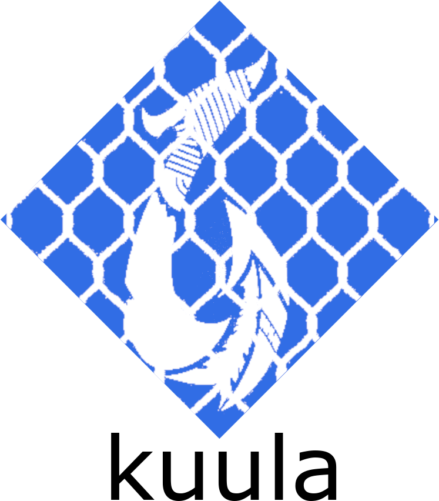

# kuula

### development

Under this repo we have a [cli](./cli/) folder and a [server](./server/) folder; within `server` there is a Go server and under `/python` a folder called [torchserver](./server/python/torchserver/) which holds code for a server that works as a pythorch wrapper.

The `cli` folder holds the command line client which can be used to create a definition file and deploy code -- it serializes the code and sends it to the `server` which in turn would deserialize it and pass it to the `torchserver` to expose models that our Go server receives and loads. This step is lacking as there are bugs to be ironed out and I had to put this project to a halt due to time restrictions.

current implementation just serves as a toy to communicate cli and server.